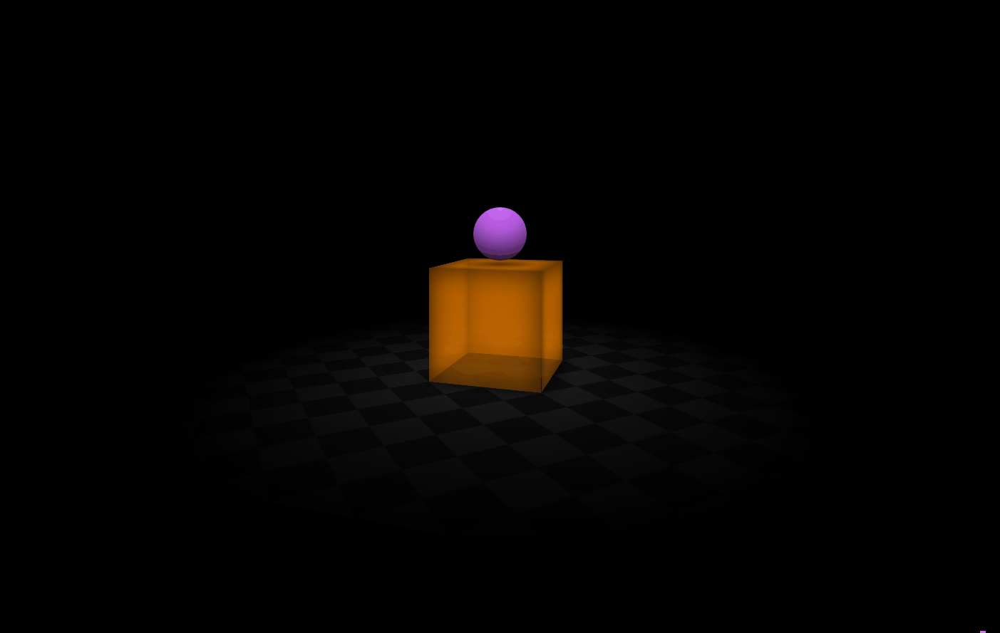

# ⭐ CSS-3D 🧨
Learning how to use 3D and perspective in Css with the tutorial of <a href="https://www.youtube.com/watch?v=NdftnCDwKaU"/>Kevin Powell</a>

# 💻 Demo 

[[Live Demo]](https://tomas-trls.github.io/css-3d/)

